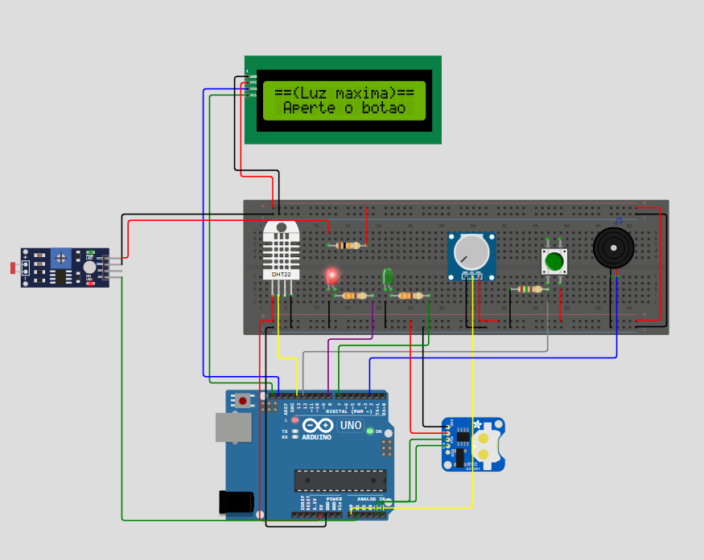

# 🛰️ Data Logger Ambiental - Monitoramento Inteligente

## Faculdade de Engenharia Salvador Arena

Um dispositivo de registro de dados (`Data Logger`) desenvolvido como projeto acadêmico para monitorar em tempo real as condições de temperatura, umidade e luminosidade de um ambiente controlado.

### 👥 Equipe

* **Guilherme de Oliveira Mattos** - RA: 082230009
* **Luigi Guilherme Pereira Silva** - RA: 082230025
* **Paulo Henrique de Carvalho Santos** - RA: 082230006
* **Tayson Moisés Costa do Carmo** - RA: 082230008
* **Pedro Henrique de Holanda Carvalho** - RA: 082230005

---

### 📜 Índice

* [Visão Geral do Projeto](#-visão-geral-do-projeto)
* [🚀 Funcionalidades Principais](#-funcionalidades-principais)
* [🛠️ Especificações Técnicas](#️-especificações-técnicas)
* [🔌 Diagrama Elétrico](#-diagrama-elétrico)
* [📖 Manual de Operação](#-manual-de-operação)
* [📂 Código Fonte](#-código-fonte)
* [▶️ Vídeo Demonstrativo](#️-vídeo-demonstrativo)

---

### 🔭 Visão Geral do Projeto

Este projeto consiste em um `Data Logger` autônomo, construído com a plataforma Arduino. Ele é capaz de realizar leituras precisas de **temperatura**, **umidade** e **luminosidade**, exibindo-as em um display LCD. O dispositivo armazena registros na memória interna (EEPROM) quando os parâmetros ambientais ultrapassam os limites pré-configurados pelo usuário, criando um histórico de anomalias com data e hora exatas, graças ao módulo RTC (Real-Time Clock).

O sistema possui uma interface de usuário intuitiva, controlada por um potenciômetro e um botão, permitindo a navegação entre menus, a visualização de dados e a configuração dos gatilhos de alerta.

---

### 🚀 Funcionalidades Principais

* **Monitoramento em Tempo Real**: Leitura contínua dos sensores e exibição dos dados no display LCD.
* **Registro de Dados (Logging)**: Armazenamento automático na EEPROM quando as medições saem da faixa segura configurada. Cada registro inclui timestamp, temperatura, umidade e luminosidade.
* **Alertas Configuráveis**: O usuário pode definir os valores mínimos e máximos para temperatura, umidade e luminosidade através de um menu interativo.
* **Alertas Sonoros e Visuais**: Um buzzer e LEDs (verde para status normal, vermelho para alerta/standby) fornecem feedback imediato sobre as condições do ambiente.
* **Interface de Navegação**: Um potenciômetro para selecionar opções e um botão para confirmar tornam a operação simples e direta.
* **Calibração de Luminosidade**: Sistema de calibração do sensor LDR na inicialização para garantir medições percentuais mais precisas de acordo com o ambiente.
* **Conversão de Unidades**: A temperatura pode ser exibida em Celsius ($^{\circ}C$), Kelvin ($K$) e Fahrenheit ($^{\circ}F$).
* **Extração de Logs**: Os dados armazenados podem ser facilmente extraídos através do Monitor Serial da IDE do Arduino.

---

### 🛠️ Especificações Técnicas

#### Hardware
| Componente | Especificação/Modelo | Função |
| :--- | :--- | :--- |
| **Microcontrolador** | ATmega328P (Arduino UNO R3) | Cérebro do projeto, processa os dados e controla os periféricos. |
| **Sensor Temp./Umidade**| DHT22 | Mede a temperatura ($^{\circ}C$) e a umidade relativa do ar (%). |
| **Sensor de Luz** | LDR (Light Dependent Resistor) | Mede a intensidade luminosa do ambiente (%). |
| **Display** | LCD 16x2 com Módulo I2C | Exibe a interface do usuário, menus e dados dos sensores. |
| **Armazenamento** | Memória EEPROM (interna do ATmega328P) | Armazena até 100 registros de dados quando os gatilhos são ativados. |
| **Relógio** | Módulo RTC DS1307 | Fornece data e hora precisas para os registros (timestamps). |
| **Interface** | Potenciômetro 10KΩ e Push Button | Permitem a navegação e seleção nas opções do menu. |
| **Atuadores** | Buzzer, LED Verde e LED Vermelho | Fornecem alertas sonoros e status visual do sistema. |

#### Pinagem (Pinout)
| Componente | Pino no Arduino |
| :--- | :--- |
| **DHT22 (Sinal)** | Digital 13 |
| **LDR (Sinal)** | Analógico A1 |
| **Potenciômetro (Sinal)**| Analógico A0 |
| **Botão (Sinal)** | Digital 12 |
| **Buzzer (Sinal)** | Digital 2 |
| **LED Vermelho** | Digital 8 |
| **LED Verde** | Digital 7 |
| **LCD e RTC (SCL)** | Analógico A5 |
| **LCD e RTC (SDA)** | Analógico A4 |

---

### 🔌 Diagrama Elétrico

O circuito foi montado conforme o diagrama abaixo, utilizando o simulador Wokwi para prototipagem e testes.

*Figura 1: Esquema de ligação dos componentes no Wokwi.*

---

### 📖 Manual de Operação

Siga os passos abaixo para operar o Data Logger:

1.  **Ligar o Dispositivo**: Conecte a alimentação. O sistema iniciará automaticamente.

2.  **Calibração do Sensor de Luz (LDR)**:
    * Ao ligar, o LCD pedirá para calibrar a **luz máxima**. Exponha o sensor LDR à maior intensidade de luz do ambiente e pressione o botão.
    * Em seguida, o LCD pedirá para calibrar a **luz mínima**. Cubra o sensor LDR para bloquear a luz e pressione o botão.
    * O sistema confirmará o sucesso da calibração e irá para o menu principal.

3.  **Menu Principal**:
    * Use o **potenciômetro** para navegar entre as três opções principais: `Menu` (monitoramento), `Setup` (configuração) e `LOG` (extração de dados).
    * Pressione o **botão** para selecionar a opção desejada.

4.  **Modo Monitoramento (`> Menu`)**:
    * Nesta tela, o LED verde ficará aceso, indicando operação normal.
    * Gire o potenciômetro para alternar a visualização entre: **Data**, **Horário**, **Umidade**, **Temperatura** e **Luminosidade**.
    * Se algum valor sair da faixa configurada, o buzzer soará e um registro será salvo na EEPROM.
    * Para sair, selecione a opção `< Voltar` e pressione o botão.

5.  **Modo Configuração (`> Setup`)**:
    * Permite ajustar os limites (triggers) dos sensores.
    * Selecione qual sensor deseja configurar: `Umidade`, `Temperatura` ou `Luminosidade`.
    * **Para Temperatura**: Você pode configurar os `Limites` ou as `Unidades`.
        * **Limites**: Use o potenciômetro para definir o valor **mínimo** e pressione o botão. Depois, defina o valor **máximo** e pressione o botão.
        * **Unidades**: Escolha entre `Celsius`, `Kelvin` ou `Fahrenheit` e pressione o botão.
    * **Para Umidade/Luminosidade**: O processo é o mesmo para definir os limites mínimo e máximo.

6.  **Visualização dos Logs (`> LOG`)**:
    * **Importante**: Esta função não exibe os logs no LCD. Ela envia todos os dados armazenados na EEPROM para um computador.
    * **Para visualizar**:
        1.  Mantenha o Arduino conectado ao computador via USB.
        2.  Na Arduino IDE, vá em **Ferramentas > Monitor Serial**.
        3.  Configure a velocidade (baud rate) para **9600**.
        4.  No menu do Data Logger, selecione a opção `LOG` e pressione o botão.
        5.  Os dados serão impressos no Monitor Serial em formato de tabela.

---

### 📂 Código Fonte

O código-fonte completo e comentado está disponível neste repositório. O nome do arquivo principal é `DataLogger.ino` (ou o nome que você deu ao seu sketch principal).

Para compilar o projeto, você precisará da **Arduino IDE** e das seguintes bibliotecas:
* `Wire` (geralmente já incluída)
* `LiquidCrystal_I2C` by Frank de Brabander
* `DHT sensor library` by Adafruit
* `Adafruit Unified Sensor` by Adafruit (dependência da biblioteca DHT)
* `RTClib` by Adafruit

Você pode instalá-las facilmente através do **Gerenciador de Bibliotecas** da Arduino IDE (`Ferramentas > Gerenciar Bibliotecas`).

---

### ▶️ Vídeo Demonstrativo

Assista ao nosso vídeo de 3 minutos apresentando as funcionalidades do Data Logger em ação!

**(Inserir o link público do vídeo no YouTube aqui)**
